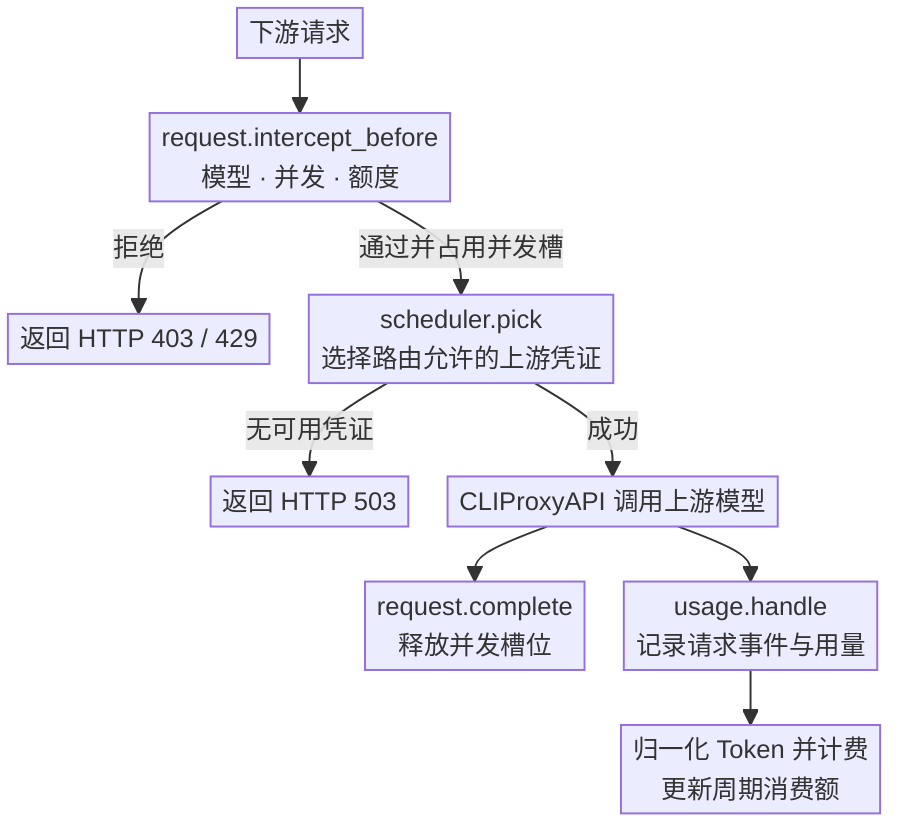
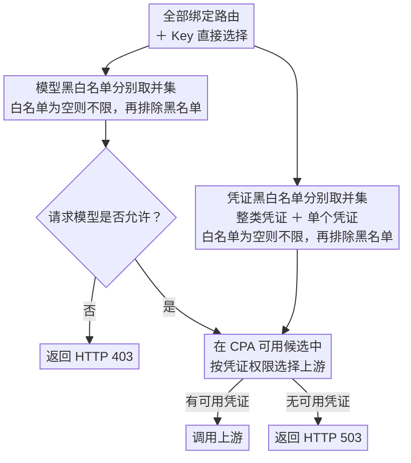

<div align="center">
  <h1>CPA Key Billing</h1>
  <p><strong><a href="https://github.com/router-for-me/CLIProxyAPI">CLIProxyAPI</a> 下游 API Key 计费与订阅额度插件。</strong></p>
  <p>
    <a href="https://github.com/haowang02/cpa-plugin-key-billing/releases/latest"></a>
    <a href="https://github.com/haowang02/cpa-plugin-key-billing/actions/workflows/check.yml"></a>
    
    <a href="./LICENSE"></a>
  </p>
  <p><a href="./README.en.md">English</a> · <strong>简体中文</strong></p>
</div>


## 功能特性

- 支持金额、Token、请求三种额度，可按 API Key 独立计时或按订阅计划统一周期重置
- 支持按输入 Token 阈值切换长上下文**阶梯计价**
- 支持按 API Key 设置**最大并发请求数**
- 支持为每个 API Key 绑定**路由规则**，限制模型访问范围和上游凭证
- 可从 [models.dev](https://models.dev/) 获取模型参考价

## 工作原理

插件会在请求到达上游前检查订阅额度、并发和路由。上游调用结束后，CLIProxyAPI 通过 `usage.handle` 提供用量。插件据此记录请求事件、计算费用并更新周期消费额。



## 环境要求

- CLIProxyAPI `7.2.143` 或更高版本，建议使用最新版本
- 使用支持插件的 CLIProxyAPI 构建，不要使用 no-plugin 版本

## 安装

在 CLIProxyAPI 根目录运行。macOS 和 Linux 使用：

```sh
curl -LsSf https://raw.githubusercontent.com/haowang02/cpa-plugin-key-billing/main/install.sh | sh
```

Windows 请先停止 CLIProxyAPI，再在 PowerShell 中运行：

```powershell
irm https://raw.githubusercontent.com/haowang02/cpa-plugin-key-billing/main/install.ps1 | iex
```

安装脚本会将插件安装到当前目录的 `plugins/`。安装或升级完成后需要重启 CLIProxyAPI。

也可以从 [Releases](../../releases/latest) 下载对应平台的发布包，解压后将动态库放入 CLIProxyAPI 的 `plugins/` 目录：

```text
plugins/cpa-key-billing.so       # Linux
plugins/cpa-key-billing.dylib    # macOS
plugins/cpa-key-billing.dll      # Windows
```

## 配置

在 CLIProxyAPI 配置文件中加入：

```yaml
plugins:
  enabled: true
  dir: "plugins"
  configs:
    cpa-key-billing:
      enabled: true
      debug: false # 是否记录 debug 日志，例如路由日志、匹配参考价日志
      codex_fast_mode_billing: false # 开启后，Codex 的 priority 请求按 2.5 倍计费
      mask_api_key_view_emails: false # 对 API Key 查询页面返回的邮箱进行掩码脱敏
      allow_api_key_quota_reset: false # 允许 API Key 用户重置可访问的 Codex 认证文件额度，消耗上游重置次数
      state_file: "plugins/cpa-key-billing-state-v1.db"
      unpriced_models: allow # 模型没有任何价格时：allow 按 0 元放行（Token/请求额度仍生效，插件日志每天提示一次），block 拒绝
      reference_price_refresh_hours: 24 # models.dev 参考价超过该小时数后，在处理用量时自动刷新；0 表示关闭
      sync_custom_prices_from_reference: true # models.dev 价格变化时，同步更新与旧参考价完全一致的自定义价
```

> [!WARNING]
> 升级前请备份数据文件。
>
> - v1.0.0 至最新版本的数据库文件支持自动迁移。
> - v0.8.4 及更早版本的 JSON 或 SQLite 数据文件不支持迁移，请将 `state_file` 指向新文件。

重启 CLIProxyAPI 后，在管理中心打开「API Key Billing」。确认模型定价后，创建订阅计划并绑定需要限制的 API Key。

## 页面访问

管理员可以从 CLIProxyAPI 管理中心的「API Key Billing」菜单进入，也可以直接打开：

```text
http(s)://<CLIProxyAPI 地址>/v0/resource/plugins/cpa-key-billing/ui
```

普通用户使用自己的 API Key 查询订阅额度和用量时，直接打开：

```text
http(s)://<CLIProxyAPI 地址>/v0/resource/plugins/cpa-key-billing/ui#account
```

## 计费与订阅规则

- 未绑定订阅计划的 API Key 只统计用量，不限制额度。
- 订阅计划可设置多个自定义额度窗口，每个窗口可单独或组合限制金额、Token、请求数。
- 每个 API Key 独立记账。独立周期从首次放行开始；统一周期可为各窗口指定下次开始时间，所有绑定 Key 按固定时间重置。
- 手动重置额度时，统一周期的重置时间保持不变；独立周期在下一次放行时重新开始。
- 自定义价优先于 models.dev 参考价。两者都没有时，默认（`unpriced_models: allow`）按 0 元放行并计入 Token、请求额度，金额额度不会增加；设为 `block` 则拒绝新请求。
- models.dev 参考价会在超过 `reference_price_refresh_hours` 后自动刷新。刷新在 CLIProxyAPI 投递用量时同步完成，不会延迟客户端请求，插件也不启动后台任务。
- 从参考价复制的自定义价（数值与参考价完全一致）会随 models.dev 更新；手动修改过的自定义价不会被覆盖。
- 请求事件保留最近 365 天。

## 路由规则

在 API Key 页面绑定路由规则，也可直接选择模型、整类凭证或单个凭证。点击模型或凭证的选框，可在未选择、白名单（勾号）、黑名单（叉号）之间切换。整类凭证包含该类别后续新增的凭证，也可用黑名单排除其中的单个凭证。模型与凭证分别合并所有绑定规则和直接选择：白名单取并集，黑名单取并集，黑名单优先。白名单为空时允许全部，再排除黑名单。



## 拦截请求的响应

| 场景 | 状态码 | `type` | `code` |
| --- | --- | --- | --- |
| API Key 并发已满 | `429` | `rate_limit_error` | `rate_limit_exceeded` |
| 订阅额度用尽 | `429` | `rate_limit_error` | `rate_limit_exceeded` |
| 模型无权访问 | `403` | `permission_error` | `insufficient_quota` |
| 没有符合规则且可用的凭证 | `503` | `server_error` | `internal_server_error` |
| 已绑定的路由规则不存在或损坏 | `503` | `server_error` | `routing_configuration_error` |
| 模型未定价（仅 `unpriced_models: block`） | `503` | `cpa_key_billing_error` | `model_price_error` |

## 致谢

- [LINUX DO](https://linux.do/) - 新的理想型社区
